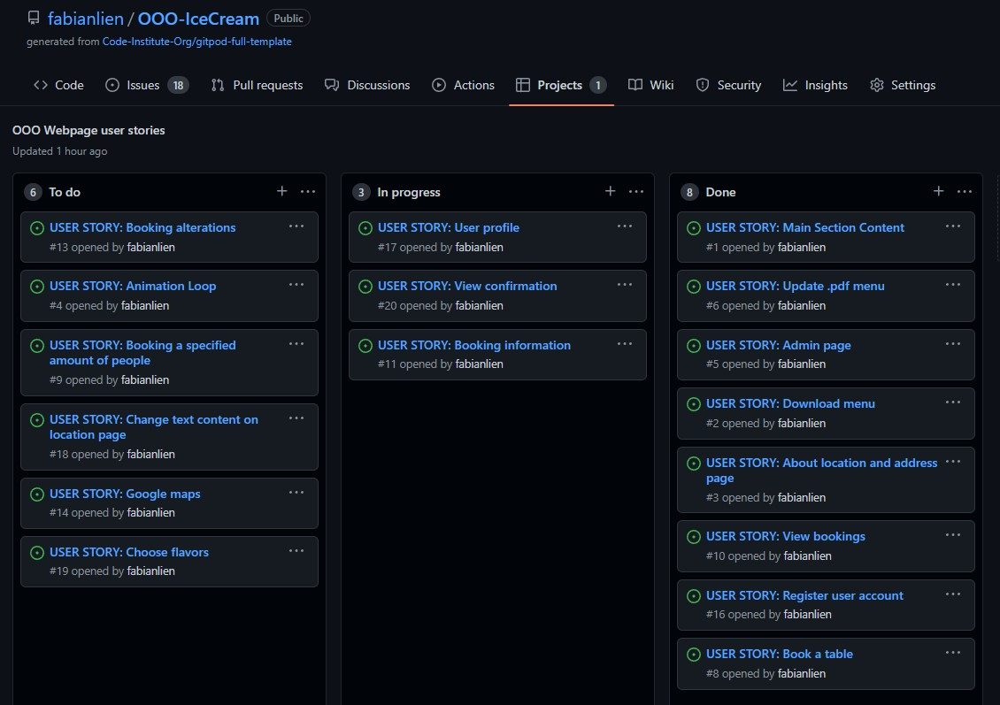

# OOO Ice Cream - [Live link](https://ooo-icecream.herokuapp.com/nybrogatan23/)

For "Triple Oh!" ice cream is more than just a sweet, nostalgic treat - it is an exploration of taste and texture, served up cold!

Previously, OOO's online pressence has only extended to a single Instagram account, but with the opening of their first permanent location, they are ready for a fully fledged webpage from which users can access information about their delicious flavours and make reservations at the brand new Nybrogatan23.  

   

## Design

### UX Aproach
This projet takes a user experience aproach to its design elements. The governing idea was to be playful enough to instantly get new users intrigued by the brand without being overwhelming. The navigation strives to be intuitive whilst remaining minimal, allowing the user to focus on interacting with visual elements rather than exploring the functionality of the website.

### Design Elements:
* **Layout**  
  The page layout utilizes bootstraps grid functionality in combination with custom css. 
* **Color**  
  As the brand already has a somewhat established social media presence, The color theme for the page follows the palate previously used for digital marketing and posters. The theme offers colors that are pastel-like and playful, whilst providing distinct recognition value.
* **Fonts**  
  The entire website utilizes the Recoleta font also found in the text logotype, which adds nicely to the overall playful feel of the brand. 

### Design Features:
* **Animation**  
  The landing page features a continous background animation, which provides the user with a sense joie de vivre shared by the Triple Oh! Philosophy.
* **Collapsable Navbar**
  All pages feature a customised collapseable bootstrap navbar with a "wavy" burger icon for all screen sizes. The elimination of constantly visible navbar links prevents the user from being distracted from the main content and simultaneously adds to the slightly minimalist feel of the website.
* **Carousel**
  - The landing page contains a bootstrap carousel with both manual and time interval rotation. The slides in the carousel provide the user with an immediate overview of key information without cluttering the screen. The carousel works intuitively in its responsiveness.
  - The Nybrogatan 23 Restaurant page also features a carousel but with a much cleaner look and a soft fade animation as opposed to the standard slide rotation. This serves to establish a more "mature" aura than what the home page strives for.
* **Cards**
  - Bootstrap's "Card" elements are featured heavily in several page of the site as they provide an easy and spacious way to display smaller snippets of text to the user.

 

## Admin Features
The website makes use of Django's built-in Admin view to provide several features:
* Account management:
  This includes CRUD functionality surrounding both user and admin accounts.
* Content management:
  Utilizing custom models the admin pages give administrators access to a simple CMS where page content can be update and new media content can be uploaded and displayed.
* Reservations:
  Through a custom model in the booking app, site administrators can filter through and confirm bookings with ease.

 

## User Features
* User Registration:
  In order to gain access to select backend CRUD functionality, a user can register to the website. Users are prompted to sign in/sign up where needed. This feature takes advantage of AllAuths built in models and templates.
* Sign in/Sign out:
  A user can easily sign in/out from anywhere on the website, with the current status being reflected to the user at the top of each page.
* Reservation form:
  Registered users can utilize a custom reservation model form in order to register a reservation request to the admin pages.
* User profile:
  Users that have logged in gain access to a profile page through the navbar where their personal bookings are display and the user has the option to add/update a message to the restaurant as well as delete bookings from the database.
* External links:
  The site contains an external link to a downloadable PDF menu for Nybrogatan23, and a link to OOO's instagram account. Both open in new tabs.
* Google Maps:
  The Nybrogatan restaurant page also includes an embedded google map through the Maps Javascript API. The map uses has a custom marker for the restaurant so that the user quickly identifies the location of the restaurant, and custom styling in order to blend in with the rest of the page.

 

## Future Features to include
### Availability Check
The most logical feature to include next would be the ability for an authenticated user to only be able to send a reservation request for a table if it is available. This would require creating a new database model for availability which relates to both the user and the reservation model, and custom a lot of custom logic to be able to identify availability parameters (time-slot duration, amount of tables, opening hours, group size). This was initially decided to not be a part of the project as it did not fit into the timeframe.

### Detail View for flavours
A neat social feature to include would be to allow the user to click on a ice cream flavour to get more details about the icecream and, if signed in, also post comments about the specified flavour. This was not included in the scope of the project because it is not part of the required business logic at this point.

### Ordering And Logistics System
The biggest potential feature to include would be the functionality required for a customer to order Ice cream for delivery. This would require a large expansion of several existing features as well as implenting new database models to manage the logistics.

 

## Custom Models
The website makes use of several custom database models to provide the neccessary functionality:
* The "Reservation" model is utilized by both the Admin CMS as well as well as user generated form input for creating and managing reservations.
* The Admin panel has access to severeal content management object models that utilize either Djangos standard database model, or "Singleton" a library that provides a model allowing only one instance to be created:
  - The "About" model allows administrators to change the content of the "About" slide.
  - The "Flavour" model provides administrators with CRUD functionality for the "Flavours" slide.
  - The "Contact" model allows administrators to store employee contact information and display it on the webpage.
  - The "Nybro23Image" model allows administrators to upload a single image file in *.jpg* or *.png* format to be displayed on the home page.
  - The "Nybro23Text" model provides CRUD funtionality through a WYSIWYG editor that displays it's content on the restaurant page.

### Custom Views
The website contains custom views for all pages except for the default views provided through Django Admin an Allauth.
 
 

## Development

### Agile Tools

#### Kanban Board:
The Project utilized Githubs Kanban board via the "projects" tab. The board was used to track the current progress of the project user stories.

#### User Stories:
Outlined below are the user stories for the project. Due to a very limited project timeline the work was not devided into distinct increments, but still followed an iterative stratagy through user story implementation:

* Admin Content Management System:
  - As a site Admin, I can upload a new pdf file, replacing the old one so that the site users can download the latest menu from the webpage.
  - As a site Admin, I can login to an admin page so that I can easily update the content on a selected webpage.
  - As a site Admin, I can use a toggle function so that I choose which ice cream flavors to display to the user.
  - As a site Admin, I can type and style text content into a field so that the text content on a the location page is updated automatically.

* Reservations:
  - As a site user, I can book a table so that I can visit the restaurant with a garuanteed seat.
  - As a site user, I can select how many people i want to book a table for so that i can visit the restaurant with a group.
  - As a site Admin, I can make alterations to specific bookings or remove them so that I can accomodate a customers specific request.
  - As a Site Admin, I can get the personal details of a specific booking so that I can contact the booker if need be.
  - As a site Admin, I can view all my bookings for a specific day so that I can prepare the restaurant.
  - As a registered user, I can view my profile page so that I can see my account details and my reservation history.
  - As a registered user, I can view my reservation status so that I know if my reservation is confirmed or not.

* Front-End Interaction:
  - As a site user, I can view a playful animation when visiting the site so that I get intrigued by the OOO brand.
  - As a site user, I can navigate to a separate page so that I can view information about the restaurant location and interior in an enticing way.
  - As a site user, I can register an account so that information about my reservations is stored and i can recieve emails from the restaurant.
  - As a site user, I can easily change the content on the main page so that I quickly find the information im looking for.
  - As a site user, I can click a link so that I can download a restaurant menu.
  - As a site user, I can interact with a google map so that I know how to find the restaurant.

 

### UI Layout
A wireframe was made to get an overview of what the landing page would look like (subsequent pages were designed in the GitPod IDE during development):

 

### Data Model
A Data modelling tool was used to create an overview of the necessary database models to ensure project functionality:

 

### Utilized Technologies

* **Coding Languages:**
  * Python
  * HTML
  * CSS
  * JavaScript  
*  **Django Framework:**
   * Colorfield - Color selector widget.
   * AllAuth - Authentication package.
   * SoloApp - Custom "singleton" model.
   * Summernote - WYSIWYG widget.
   * Crispy Forms - Form layout overhaul.
*  **Hosting Platforms:**
   * Heroku - Web application host.
   * Cloudinary - Static and media file host.
*  Coding Environment - **GitPod**
*  Version Control System - **GitHub**
*  Database Technology - **PostgreSQL**

 

### Unresolved Bugs
* There is an issue with the Google Maps API that prevents the InitMap function from executing after page load. Initial troubleshooting yielded no resolutions or work-arounds. Due to time constraints the issue remains. Further troubleshooting required.

* There has been a cloudinary issue since early deployment which prevents pushing to Heroku due to some unknown Value error in the cloudinary source code. The current work-around is to delete all static files from the cloudinary database before each push. If the issue remains unresolved I will consider changing to another static file host provider.

* There is a minor logic issue in the static JavaScript file which causes the "active" class navbar list item not to correspond to the "active" class carousel item. Initially this was thought to be a simple +1 error, but it proved more complicated to fix than anticipated, and due to time restraints it goes unresolved.

 

## Testing

### Validation
The following URIs passed through the W3C validator and returned no errors:
* https://8000-fabianlien-oooicecream-l1sobjd6doz.ws-eu45.gitpod.io/ (*Home*)
* https://8000-fabianlien-oooicecream-l1sobjd6doz.ws-eu45.gitpod.io/nybrogatan23/ (*Nybrogatan 23 Restaurant*)
* https://8000-fabianlien-oooicecream-l1sobjd6doz.ws-eu45.gitpod.io/accounts/password/reset/
* https://8000-fabianlien-oooicecream-l1sobjd6doz.ws-eu45.gitpod.io/accounts/login/
* https://8000-fabianlien-oooicecream-l1sobjd6doz.ws-eu45.gitpod.io/accounts/signup/

The following files have been passed through PEP8 Online and returned no errors or warnings:
* BookingApp/admin.py
* BookingApp/forms.py
* BookingApp/models.py
* BookingApp/urls.py
* BookingApp/views.py
* Webapp/admin.py
* Webapp/models.py
* Webapp/urls.py
* Webapp/views.py

The file styles.css passed through the W3C Validator with no errors.

The file script.js passed through JSHint with no errors.

The following scores were given when running google lighthouse:  

 

## Deployment

### Development

1. Clone [this repository](https://github.com/TimSchulz1991/msp4-django-8gag)
2. Install Python
3. Install Django and create an app using these commands in your terminal

        pip3 install Django==3.2 gunicorn
        django-admin startproject your_project_name .
        python3 manage.py startapp your_app_name
        pip3 install -r requirements.txt
        python3 manage.py makemigrations
        python3 manage.py migrate

- Make sure your INSTALLED_APPS in settings.py looks like this:

        INSTALLED_APPS = [
            'django.contrib.admin',
            'django.contrib.auth',
            'django.contrib.contenttypes',
            'django.contrib.sessions',
            'django.contrib.messages',
            'cloudinary_storage',
            'django.contrib.staticfiles',
            'cloudinary',
            'crispy_forms',
            'your_app_name',
        ]

4. Create or log in to an account on Heroku
5. Create a new app on Heroku
6. Open your app on Heroku and go to Resources, Add-ons and search for PostgreSQL
7. Add PostgreSQL
8. In the Deploy section on Heroku, go to Deployment method and add your GitHub repository
9. Create or log in to an account on Cloudinary
10. Copy your API Environment Variable
11. Go back to Heroku, Settings and click on Reveal Config Vars
12. Add your Cloudinary API variable, SECRET_KEY and DISABLE_COLLECTSTATIC. PostgreSQL should already be there.
    - CLOUDINARY_URL | your_api_variable
    - SECRET_KEY | your_choice ([Secret Key Generator](https://miniwebtool.com/django-secret-key-generator/))
    - DISABLE_COLLECTSTATIC | 1
13. Create an env.py in the root directory, add it to .gitignore and add these lines at the top

        import os

        os.environ["DATABASE_URL"] = "postgresql from your Heroku config vars"
        os.environ["SECRET_KEY"] = "your secret_key here"
        os.environ["CLOUDINARY_URL"] = "cloudinary url here"

14. At the top of your settings.py file, make sure these are added

        from pathlib import Path
        import os
        import dj_database_url
        from django.contrib.messages import constants as messages
        if os.path.isfile('env.py'):
            import env

15. Comment out DATABASES in your settings.py file and add the following DATABASES below

        #DATABASES = {
        #   'default': {
        #       'ENGINE': 'django.db.backends.sqlite3',
        #       'NAME': BASE_DIR / 'db.sqlite3',
        #   }
        #}

        DATABASES = {
            'default': dj_database_url.parse(os.environ.get('DATABASE_URL'))
        }

16. In your settings.py file, make sure DEBUG is set to True

        DEBUG = True

17. In your settings.py file, make sure the static files section looks like this

        STATIC_URL = '/static/'
        STATICFILES_STORAGE = 'cloudinary_storage.storage.StaticHashedCloudinaryStorage'
        STATICFILES_DIRS = [os.path.join(BASE_DIR, 'static')]
        STATIC_ROOT = os.path.join(BASE_DIR, 'staticfiles')

        MEDIA_URL = '/media/'
        MEDIA_ROOT = os.path.join(BASE_DIR, 'media')
        DEFAULT_FILE_STORAGE = 'cloudinary_storage.storage.MediaCloudinaryStorage'

18. In your terminal, run migrations

        python3 manage.py makemigrations
        python3 manage.py migrate

19. Create a superuser for your site

        python3 manage.py createsuperuser

20. Run your app locally

        python3 manage.py runserver

### Production

1. In your settings.py file, set DEBUG to False

        DEBUG = False

2. Make sure that X_FRAME_OPTIONS and ALLOWED_HOSTS are added to your settings.py file, just under DEBUG

        X_FRAME_OPTIONS = 'SAMEORIGIN'

        ALLOWED_HOSTS = ['your_app_name.herokuapp.com', 'localhost']

3. On Heroku, go to Settings and Reveal Config Vars
4. Remove DISABLE_COLLECTSTATIC
5. On Heroku, go to Deploy and scroll down to choose whichever method to deploy you want
    - You can automatically deploy the app everytime your GitHub repository is updated
    - You can manually deploy the app
6. If you need to login to Heroku and deploy via the terminal, this is how it works:
    - write "heroku login -i" in the terminal and follow the steps to log in to Heroku
    - write "git push heroku main" to deploy to Heroku
7. On Heroku, go to the Deploy section and click on the "Open App" button in the top right corner